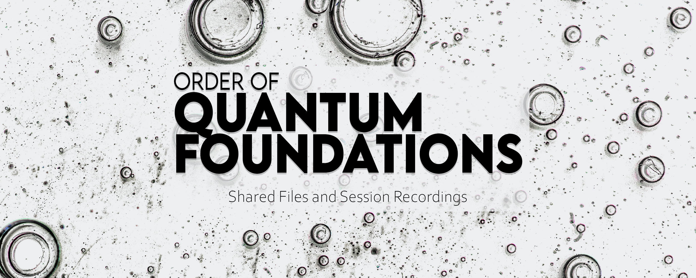

# Order of Quantum Foundations Repository

Welcome to the Circle of Quantum Foundations repository! This repository serves as a central hub for lecture notes, posters, and session recordings related to the Order of Quantum Foundations at University of Tehran - Dept. Physics.

## About the Circle of Quantum Foundations

The Circle of Quantum Foundations is a community-driven initiative dedicated to exploring and advancing our understanding of the fundamental principles and concepts underlying quantum mechanics. Through regular lectures, discussions, and collaborative projects, we aim to foster a deeper appreciation for the intricacies of quantum theory and its implications.

## Repository Contents

In this repository, you will find a wealth of valuable resources, including:

- **Lecture Notes**: Detailed notes from our thought-provoking lectures, covering a wide range of topics in quantum foundations. These notes are designed to provide a comprehensive understanding of the subject matter and serve as a valuable reference for further study.

- **Posters**: Eye-catching posters summarizing key concepts, theories, and experiments in the field of quantum foundations. These posters are perfect for visual learners and can be used as educational tools or for presentations.

- **Session Recordings**: Recordings of our engaging sessions, allowing you to revisit past discussions or catch up on any sessions you may have missed. These recordings provide an immersive experience, enabling you to learn from leading experts in the field.

## Getting Started

To access the resources in this repository, simply navigate to the corresponding folders:

- **Lecture Notes**: Browse through the lecture notes in the "Lecture Notes" folder to find the topic of your interest. Each set of notes is organized by date and lecturer for easy navigation.

- **Posters**: Explore the visually appealing posters in the "Posters" folder, where you can find concise summaries of various quantum foundations concepts. Feel free to download and use them for educational purposes.

- **Session Recordings**: Access the session recordings in the "Session Recordings" folder to immerse yourself in the discussions and insights shared during our past sessions. Each recording is labeled with the session date and topic for your convenience.

## Contributing

We encourage contributions from the community to enrich the repository and foster collaboration. If you have lecture notes, posters, or session recordings that you would like to share, please follow our contribution guidelines outlined in the [CONTRIBUTING.md](CONTRIBUTING.md) file.

## Contact

If you have any questions, suggestions, or feedback, please don't hesitate to reach out to us. You can contact us via email at [thisismeamir@outlook.com](mailto:thisismeamir@outlook.com) or join our community forum at [TheQuantumFoundations](https://t.me/TheQuantumFoundations).

We hope you find this repository valuable and enjoy your journey into the fascinating world of quantum foundations!

